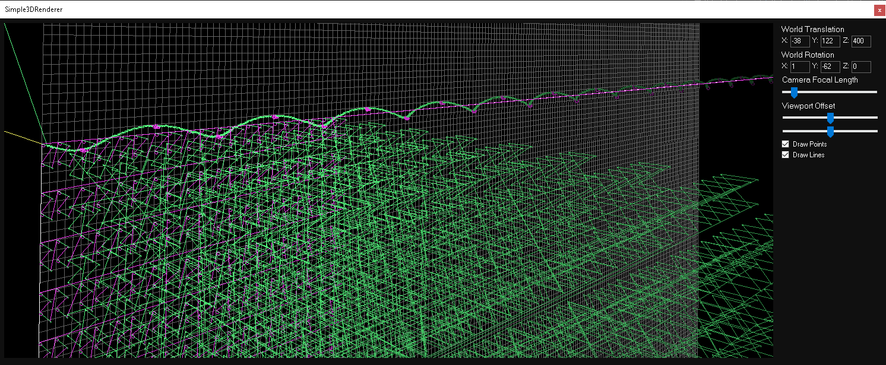

# Simple3DRenderer (this is a work progress!)
A basic 3D renderer built with WinForms. \
I originally made this program as a **3D grapher** to graph the **imaginary plane**. It currently works as such but it has a **lot of bugs**.

# Camera Controls
- **SHIFT + M_MOUSE** Pan camera
- **M_MOUSE** Rotate camera about origin

# Movement Controls
- **W, S, A, D** Basic movement
- **CTRL** Increase movement speed (while held down)
- **Z, X** Move up and down
- **Q, E** Rotate camera counter-clockwise/clockwise

# To Build
- Load the project in Visual Studio and click `Build -> Build Solution`!